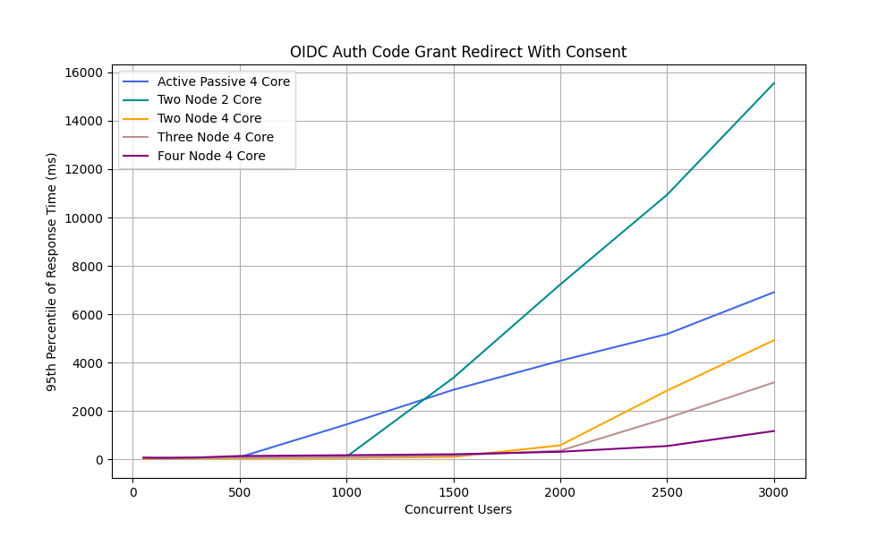

# IAM Performance Test Results Comparison

During each release, we execute various automated performance test scenarios and publish the results.

| Test Scenarios | Description |
| --- | --- |
| Client Credentials Grant Type | Obtain an access token using the OAuth 2.0 client credential grant type. |
| OIDC Auth Code Grant Redirect With Consent | Obtain an access token and an id token using the OAuth 2.0 authorization code grant type. |
| OIDC Password Grant Type | Obtain an access token and an id token using the OAuth 2.0 password grant type. |
| SAML2 SSO Redirect Binding | Obtain a SAML 2 assertion response using redirect binding. |

Our test client is [Apache JMeter](https://jmeter.apache.org/index.html). We test each scenario for a fixed duration of
time and split the test results into warm-up and measurement parts and use the measurement part to compute the
performance metrics. For this particular instance, the duration of each test is **15 minutes** and the warm-up period is **5 minutes**.

We run the performance tests under different numbers of concurrent users and heap sizes to gain a better understanding on how the server reacts to different loads.

The main performance metrics:

1. **Throughput**: The number of requests that the WSO2 Identity Server processes during a specific time interval (e.g. per second).
2. **Response Time**: The end-to-end latency for a given operation of the WSO2 Identity Server. The complete distribution of response times was recorded.

In addition to the above metrics, we measure the load average and several memory-related metrics.

The following are the test parameters.

| Test Parameter | Description | Values |
| --- | --- | --- |
| Scenario Name | The name of the test scenario. | Refer to the above table. |
| Heap Size | The amount of memory allocated to the application | 2G |
| Concurrent Users | The number of users accessing the application at the same time. | 50, 100, 150, 300, 500, 1000, 1500, 2000, 2500, 3000 |
| IS Instance Type | The AWS instance type used to run the Identity Server. | [**c5.xlarge**](https://aws.amazon.com/ec2/instance-types/) |
| JDK version | The JDK version used to run the Identity Server. | JDK 11.0.15.1  |

In order to ease cross-comparison with earlier versions of the product, the newly introduced features/improvements are disabled when taking these performance results.

```
[authentication_policy]
disable_account_lock_handler=true

[identity_mgt.events.schemes.WorkflowPendingUserAuthnHandler]
subscriptions=[]

[authorization_manager.properties]
GroupAndRoleSeparationEnabled=false
```

The following are the measurements collected from each performance test conducted for a given combination of
test parameters.

| Measurement | Description |
| --- | --- |
| Error % | Percentage of requests with errors |
| Average Response Time (ms) | The average response time of a set of results |
| Standard Deviation of Response Time (ms) | The Standard Deviation of the response time. |
| 99th Percentile of Response Time (ms) | 99% of the requests took no more than this time. The remaining samples took at least as long as this |
| Throughput (Requests/sec) | The throughput measured in requests per second. |
| Average Memory Footprint After Full GC (M) | The average memory consumed by the application after a full garbage collection event. |

The following is the summary of performance test results collected for the measurement period.


### 1. Client Credentials Grant Type

#### Obtain an access token using the OAuth 2.0 client credential grant type.

<ins> Concurrency: 50 - 500 </ins>


<ins> Concurrency: 50 - 3000 </ins>


### 2. OIDC Auth Code Grant Redirect With Consent

#### Obtain an access token and an id token using the OAuth 2.0 authorization code grant type.

<ins> Concurrency: 50 - 500 </ins>


<ins> Concurrency: 50 - 3000 </ins>



### 3. OIDC Password Grant Type

#### Obtain an access token and an id token using the OAuth 2.0 password grant type.

<ins> Concurrency: 50 - 500 </ins>


<ins> Concurrency: 50 - 3000 </ins>


### 4. SAML2 SSO Redirect Binding

#### Obtain a SAML 2 assertion response using redirect binding.

<ins> Concurrency: 50 - 500 </ins>


<ins> Concurrency: 50 - 3000 </ins>


